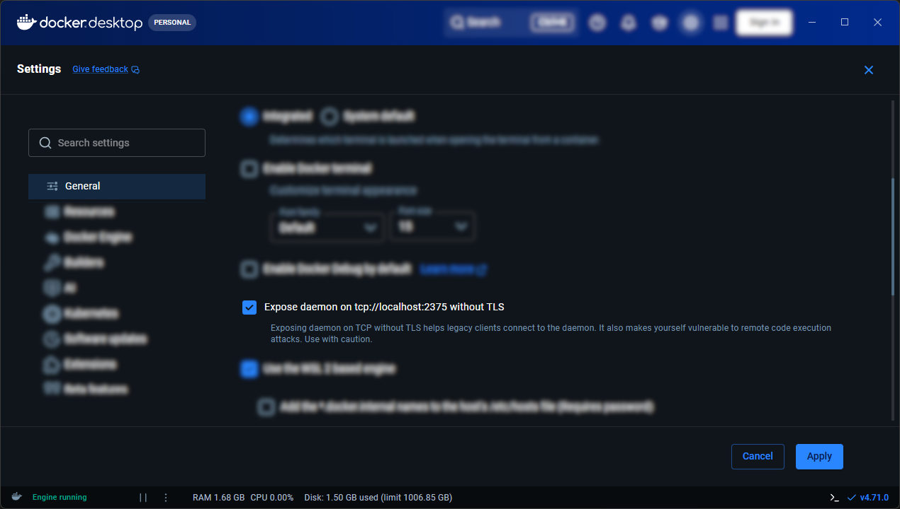

# 💖 Contributing

## 🚀 Build it yourself

### 1. Build the frontend

```sh
cd frontend
npm install
npm run build   # outputs into ../backend/public
```

### 2. Serve the backend

For local development:

```sh
cd backend
php -S localhost:8000 -t public public/router.php
```

The `router.php` script makes the built-in PHP server replicate what `.htaccess` does under Apache (serve static assets, route `/api/*` to `index.php`, fall back to the SPA otherwise).

Open `http://localhost:8000` and you're in.

### Frontend dev mode

If you want hot-reload while iterating on the UI:

```sh
# terminal 1
cd backend && php -S localhost:8000 -t public

# terminal 2
cd frontend && npm run dev
```

Vite proxies `/api` → `localhost:8000` so cookies behave correctly.

## 🧪 Testing

The test suite spins up real database containers using [Testcontainers](https://testcontainers.com/), so you need Docker running locally before executing any tests.

### 1. Install Docker

| Platform | Instructions |
| -------- | ------------ |
| **macOS** | Install [Docker Desktop for Mac](https://docs.docker.com/desktop/install/mac-install/). Once installed, start Docker Desktop from your Applications folder. |
| **Windows** | Install [Docker Desktop for Windows](https://docs.docker.com/desktop/install/windows-install/). After installation, open Docker Desktop settings → **General** and enable **Expose daemon on `tcp://localhost:2375` without TLS**. |
| **Linux** | Install the [Docker Engine](https://docs.docker.com/engine/install/) for your distro. After installation, add your user to the `docker` group so you can run commands without `sudo`: `sudo usermod -aG docker $USER` (then log out and back in). |

> **Windows only:** The daemon exposure setting is required because Testcontainers on Windows connects over TCP rather than a Unix socket.
>
> 

### 2. Verify Docker is running

```bash
docker info
```

You should see engine information printed without any connection errors. If you see `Cannot connect to the Docker daemon`, start Docker Desktop (macOS/Windows) or run `sudo systemctl start docker` (Linux).

### 3. Install PHP dependencies

From the `backend` directory:

```bash
cd backend
composer install
```

This pulls in the test framework ([Pest](https://pestphp.com/)), the Testcontainers library and all application dependencies.

### 4. Run the tests

```bash
cd backend # if not already there
composer test
```

Each engine's test file boots its own container on first run, executes the full driver contract, then tears the container down. The SQLite tests run without a container and are always fast; the server-based engines (MySQL, MariaDB, PostgreSQL, SQL Server) pull their images on the first run, which may take a minute or two depending on your connection.

### Skipped tests

A test file is skipped automatically — rather than failing — when:

- Docker is not running or not on `PATH`.
- A required PHP extension is missing (e.g. `pdo_sqlsrv` for SQL Server).
- The `testcontainers/testcontainers` package is not installed.

The skip message printed by Pest will tell you exactly what is missing and how to fix it.

### SQL Server is not tested yet

Currently, we don't have any SQL Server tests in the suite because `testcontainers/testcontainers-php` [doesn't support it yet](https://github.com/testcontainers/testcontainers-php/tree/266f0beca7bfc654b763c97b6ba7d228eb4a3d8e/src/Modules).
