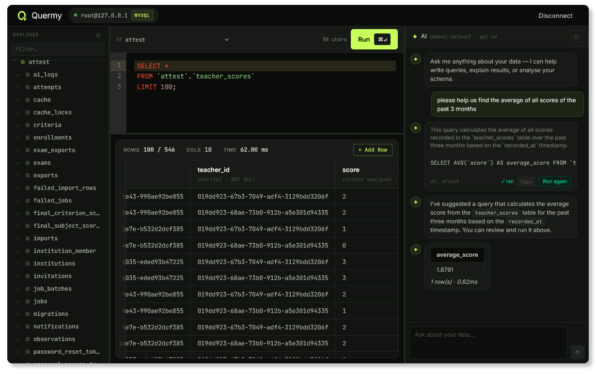

# Quermy

A drop-in MySQL companion for W/LAMP stacks. Lightweight alternative to phpMyAdmin with a modern Svelte UI and BYOK (Bring Your Own Key) AI assistance for query writing and schema exploration.

> [!WARNING]
> This is a prototype, not production-ready software. Use at your own risk.

## 🧃 Use a pre-built release

For your convenience there are [pre-built releases of Quermy](https://github.com/luttje/quermy/releases), ready to drop into your stack.

### For Laragon users

1. Download the `quermy-laragon-<version>.zip` from the latest release
2. Unzip it
3. Drop the entire `laragon` folder from the zip over your Laragon installation (overwrite when prompted):
    So if you installed Laragon in `C:\laragon`, you drop the folder into `C:\`
4. Restart Apache from the Laragon control panel. [(view Apache alias example)](tools/releases/laragon/quermy.conf)

Quermy will be available at `http://localhost/quermy`.

What these steps do and why

The above steps place Quermy into `<LaragonDirectory>/etc/apps/quermy`, along with an Apache alias file `<LaragonDirectory>/etc/apache2/alias/quermy.conf` that points the URL path `/quermy` to that directory. Laragon automatically includes all alias files in its Apache configuration, so this makes Quermy available without you having to manually edit Apache's config.

### For tinkerers

1. Download the `quermy-<version>.zip` from the latest release
2. Unzip the file
3. Point your web server at the `public` directory.

## 💖 Contributing

**Want to build the project yourself, or contribute to the codebase?** Great! Contributions are very welcome. Please see [CONTRIBUTING.md](CONTRIBUTING.md) for setup instructions and guidelines.
